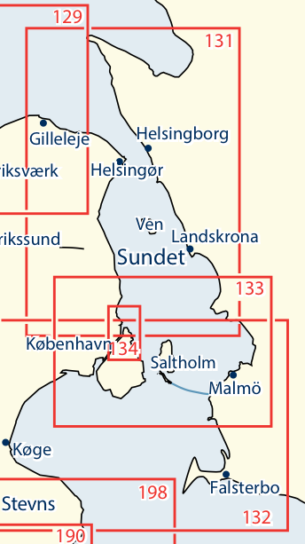

# Sailing Area
The sailing area is limited to the Sound (Sundet), unless there is prior
authorization from sailing centre leadership, which will not be unduly refused.
The northern limit extends from Gilleleje harbour to Sweden (Kullen point
light). The southern limit extends in a line between Stevns Klint light and
Falsterbo reef light.

# Neighboring harbour mooring places:
- Vedbæk
- Rungsted

# KDY Approved Boat Skippers
An approved boat skipper is a KDY sail centre and club member or employee who
is approved to take out one or more types of boats owned or leased by KDY.

There are three types of approval:

- Skipper
- Instructor
- Professional event sailing skipper

A list of all approved skippers is maintained by sailing school administrator.

# KDY Skipper Approval Criteria
- Practical sailing keel boat handling competencies; through KDY, a minimum
  would be 2 seasons sail training & 50 logged hours sailing, but other
  experience is accepted.
- Students who have a certificate of competency (or equivalent) can undertake
  the preparatory course.
- Participate in preparatory training to ensure standards and harmonized
  approach to boat and crew management as well as safety.
- Pass test to successfully demonstrate key boat handling competencies and
  knowledge of KDY sailing and safety procedures.
- Demonstrable knowledge in maintenance (as specified in maintenance schedule).
- Commit to take and pass Day Skipper or Dueligheds exam and VHF SRC within 12
  months, if not already held (approval is rescinded if not accomplished).
- Participate in annual maintenance days for boat type for which approved
  (unless active instructor).
- No outstanding insurance or damage claims.
- Personal liability insurance.
- Pay deposit for access to booking system and key fob.

# KDY Fair Weather Skippers
- Can take out the boat type they are approved for in up to moderate conditions
  (Beaufort 4, <8ms wind) from their home harbour with at least one other
  experienced crew member (who has completed basic skills training at KDY on
  this boat type or has competent crew or skipper certificate) on board. 
- Are covered by KDY Club insurance for 3rd party liability with an excess of 7500DKK. Damages must be reported and made good.
- Must plan and register passage in log book and inform others (on land) of
  plan and on return.
- Can only take crew who are active members of KDY sailing centre.
- Cannot skipper the boats to participate in regattas.
- Can skipper from May 1st to October 15th from dawn to dusk.
- Approval lapses if no boat booked and sailed or logs repeatedly not
  completed, or damages not made good or club membership in abeyance for 2
  seasons

# KDY Club Boat Skipper Training

Students should be able to demonstrate the following competencies in moderate
sailing conditions:

1. Safety briefing, pre-sailing, and after-sailing checks.
2. Safe and quick manoeuvres in limited spaces.
3. Safe departure and entrance to harbour and berth.
4. Understanding of weather forecasts.
5. Clear instruction to crew.
6. Competency in reefing and heaving to.
7. Use of compass and compass steering.
8. Practical understaing of KDY safety procedures, collision regulations
   (IRPCS), and Sail Safety guidance.
9. Successful man overboard (MOB) manoeuvre and recovery drill (SPHERES).
10. Anchoring and securing the boat at sea.
11. Picking up a mooring and stopping at buoys.
12. Mastery of give way & stand on vessels (power, sail, other categories and
    rules in the collision regulations)
13. Familiar with safety bag contents.
14. Knowledge of sailing rules for use of KDY club boats, including log books,
    booking system use, and incident reporting.
15. Knowledge of hypothermia, secondary drowning, CPR, concussion, and shock.

Students should be able to do the following maintenance tasks:

1. Tasks described in duelighedsbevis training.
2. Sand hull.
3. Replace halyard.
4. Replace split pins.
5. Heat seal rope ends.
6. Tape rigging.
7. Undertake visual check of rigging from deck.
8. Remove and fit sails and sail battens.
9. Remove decals from hull.
10. Tape spinnaker sail rips.
11. Hoist J/70 on crane.
12. Secure J/70 on trailer.
13. Inform on the use of spares.
14. Supervise and train less experienced sailors in maintenance tasks.

# Skipper to Crew / Instructor to Student Ratios
- DS37: Max 7 people on board. Instructor on board: 1:6 students.
- J70: Max 5 people on board. Instructor on board: 1:4 students.
- RIB: Max 7 people on board. Instructor on board: 1:5 students.

# KDY Personal Flotation Device (PFD) Requirements
- 150N Life Jacket.
- Fixed or Self-inflating.
- High visibility colour.
- Whistle and/or light.
- CE certified standard.
- Correct size with crotch strap.
- Head and neck protection.
- Integrated harness and D ring.

# Bad Weather Criteria

Sail training is postponed or replaced with shore training in the event of: 

- Forecast of gales (kulingvarsel) or fog in Oresund;
- Lightning strike visible or thunder clap (Return to harbour. Leave boat.
  Minimum 30 minutes wait);
- [DMI](https://www.dmi.dk) radar shows front with lightning strikes moving towards Oresund;
- [DMI Readings](https://www.dmi.dk/malinger-seneste-24-timer/) show wind speed
  over 14 m/sec (measured at Drogden Fyr, Hellerup, or Rungsted.;
- The instructor (or skipper) decides that the weather conditions are too
  adverse for the crew or their own capability.

!!! Note
    It is the skippers responsibility to check the weather forecast before
    setting  out from the harbour.
